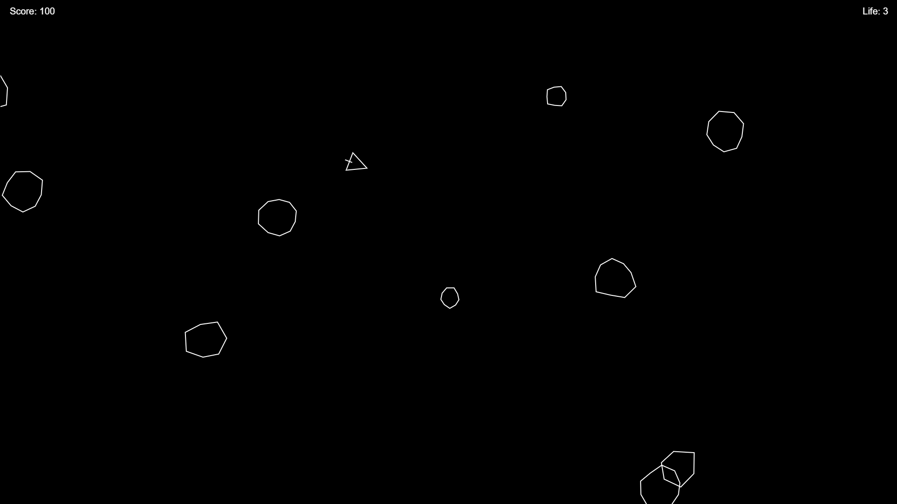

# Asteroid Clone

Uma versao simplificada do clássico jogo Asteroids, desenvolvida com HTML, CSS e JavaScript.

## Recursos

<li>Gameplay Clássico: Controle a nave, dispare projéteis e evite colisões com asteroides.</li>
<li>Pontuação: Ganhe pontos destruindo os asteroides.</li>
<li>Responsividade: Jogabilidade adaptada para execução em navegadores modernos.</li>
<li>Código Limpo e Modularizado: Estrutura organizada com arquivos separados para HTML, CSS e JavaScript.</li>

## Captura de tela



## Como Jogar

<h3>1. Controles: </h3>
<li>Setas do teclado: Gire a nave e movimente-se pelo cenário.</li>
<li>Barra de espaço: Dispare os projéteis para destruir os asteroides.</li>

<h3>2. Objetivo</h3>
<li>Sobreviva o máximo de tempo possível enquanto destrói os asteroides e acumula pontos. Evite colisões para não perder vidas.</li>

## Instalação e Execução

- Execute no terminal:

```sh
git clone https://github.com/AkiroSetonai/Asteroid-Clone.git
```

- Acesse o Diretório do Projeto:

```sh
cd ASTEROID-CLONE

```

- Abra o Arquivo index.html

# Contribuição

Contribuições são bem-vindas! Se desejar melhorar o jogo, corrigir bugs ou adicionar novos recursos, sinta-se à vontade para abrir um issue ou enviar um pull request.
